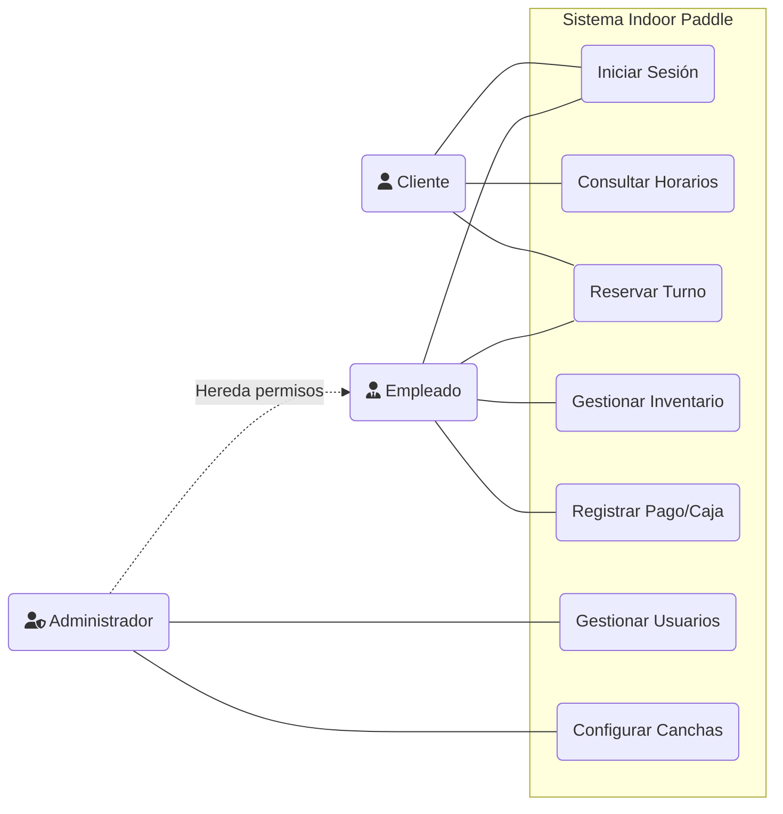
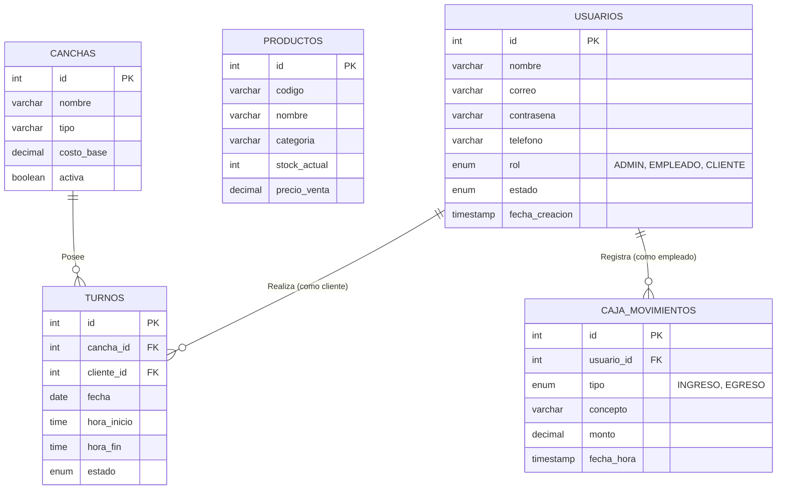
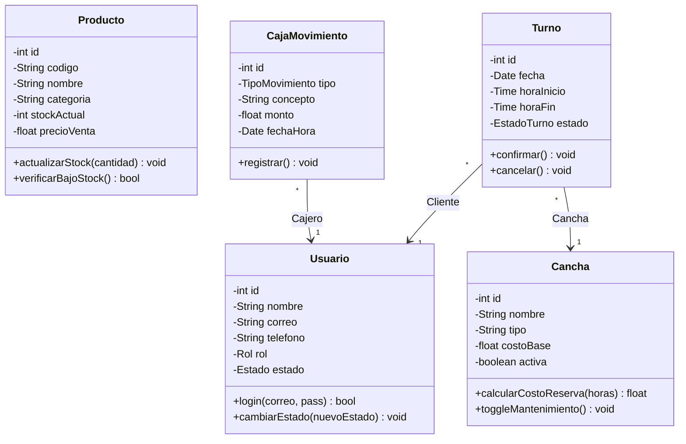

# Documento de Análisis y Diseño de Software
**Proyecto:** Sistema de Gestión Indoor Paddle  
**Rol:** Analista Funcional Senior  

---

## 1. Requerimientos del Sistema

### 1.1 Requerimientos Funcionales (RF)
Son las funciones que el sistema debe realizar para satisfacer las necesidades del negocio.

* **RF-01 Gestión de Autenticación (Login):** El sistema debe permitir el inicio de sesión validando credenciales (correo y contraseña) contra la base de datos, manejando tres roles distintos: `ADMIN`, `EMPLEADO` y `CLIENTE`.
* **RF-02 Gestión de Inventario (Stock):** El sistema debe permitir al Administrador y al Empleado consultar, agregar, editar y eliminar productos de venta y alquiler. Debe controlar las existencias en tiempo real y emitir alertas visuales cuando el stock sea crítico.
* **RF-03 Gestión de Usuarios:** El sistema debe permitir crear y gestionar perfiles de staff y clientes. Debe incluir la capacidad de suspender (`BLOQUEAR`) a un usuario por falta de pago o mala conducta.
* **RF-04 Gestión de Canchas:** El sistema debe listar las canchas disponibles, permitiendo modificar su costo base y marcarlas como activas o en mantenimiento.
* **RF-05 Control de Reservas (Turnos):** El sistema debe permitir la asignación de turnos a clientes en canchas específicas, gestionando los estados del turno (`PENDIENTE`, `CONFIRMADO`, `CANCELADO`, `COMPLETADO`).
* **RF-06 Control de Caja:** El sistema debe registrar todos los movimientos de flujo de efectivo (Ingresos por alquiler/ventas y Egresos por pagos a proveedores), guardando automáticamente la fecha, monto y qué empleado realizó la transacción.

### 1.2 Requerimientos No Funcionales (RNF)
Definen los atributos de calidad, rendimiento y restricciones tecnológicas.

* **RNF-01 Arquitectura SPA:** La interfaz de usuario debe comportarse como una "Single Page Application" (SPA) usando Vanilla JavaScript, garantizando fluidez sin recargas completas de la página web.
* **RNF-02 Backend Ligero:** Los servicios de datos deben estar expuestos mediante una API REST desarrollada en **PHP puro** (sin frameworks pesados), respondiendo y consumiendo exclusivamente formato JSON.
* **RNF-03 Persistencia de Datos:** La información debe almacenarse en un motor de base de datos relacional **MySQL / MariaDB**.
* **RNF-04 Diseño UI/UX Moderno:** La interfaz debe ser altamente estética, utilizando la filosofía "Glassmorphism" y Material Design, e incorporando transiciones suaves (`fade-in`) para mejorar la experiencia del usuario.
* **RNF-05 Seguridad Básica:** Las rutas de la API deben validar que las peticiones se realicen por usuarios permitidos, y las contraseñas deben estar preparadas para hashearse en un entorno productivo.

---

## 2. Diagrama de Casos de Uso
Modela las interacciones principales entre los actores humanos y las funcionalidades del sistema.

---

## 3. Diagrama Entidad-Relación (DER)
Representa la estructura relacional de la base de datos y cómo se conectan los datos entre sí.

> [!NOTE]
> **Lectura del DER:** 
> - Un Usuario (Cliente) puede tener múltiples Turnos (1 a N).
> - Una Cancha puede tener múltiples Turnos asignados (1 a N).
> - Un Usuario (Staff/Admin) puede registrar múltiples movimientos de caja (1 a N).

---

## 4. Diagrama de Clases
Modela la abstracción orientada a objetos en el código, especialmente útil para estructurar los controladores o el backend en futuras refactorizaciones.

---

